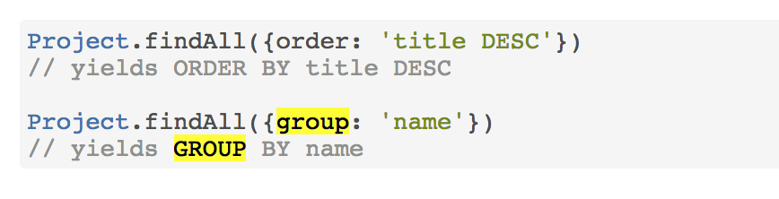

Sequelizejs

[http://docs.sequelizejs.com/manual/tutorial/models-usage.html\#including-soft-deleted-records](http://docs.sequelizejs.com/manual/tutorial/models-usage.html#including-soft-deleted-records)

select && select by field
-------------------------

```js
//js
Model.findAll({
  attributes: ['foo', 'bar']
});

//sql
SELECT foo, bar From TABELNAME


//js
Model.findAll({
  group:['foo']
});

//js
Model.findOne({
  where
});

```

order && Group by 
------------------



Transaction, promise all
------------------------

```js
 
 // source from: http://docs.sequelizejs.com/manual/tutorial/transactions.html
 
 return sequelize.transaction(function (t) {

  // chain all your queries here. make sure you return them.
  return User.create({
    firstName: 'Abraham',
    lastName: 'Lincoln'
  }, {transaction: t}).then(function (user) {
    return user.setShooter({
      firstName: 'John',
      lastName: 'Boothe'
    }, {transaction: t});
  });

}).then(function (result) {
  // Transaction has been committed
  // result is whatever the result of the promise chain returned to the transaction callback
}).catch(function (err) {
  // Transaction has been rolled back
  // err is whatever rejected the promise chain returned to the transaction callback
});
 
 
 
 // source from: https://stackoverflow.com/questions/35705622/using-loops-and-promises-in-transactions-in-sequelize
 
  var members = req.body.members;
    models.sequelize.transaction(function (t) {
        var promises = []
        for (var i = 0; i < members.length; i++) {
            var newPromise = models.User.create({'firstname':members[i], 'email':members[i], 'pending':true}, {transaction: t});
            promises.push(newPromise);
        };
        return Promise.all(promises).then(function(users) {
            var userPromises = [];
            for (var i = 0; i < users.length; i++) {
                userPromises.push(users[i].addInvitations([group], {transaction: t});
            }
            return Promise.all(userPromises);
        });
    }).then(function (result) {
        console.log("YAY");
    }).catch(function (err) {
        console.log("NO!!!");
        return next(err);
    });

```

