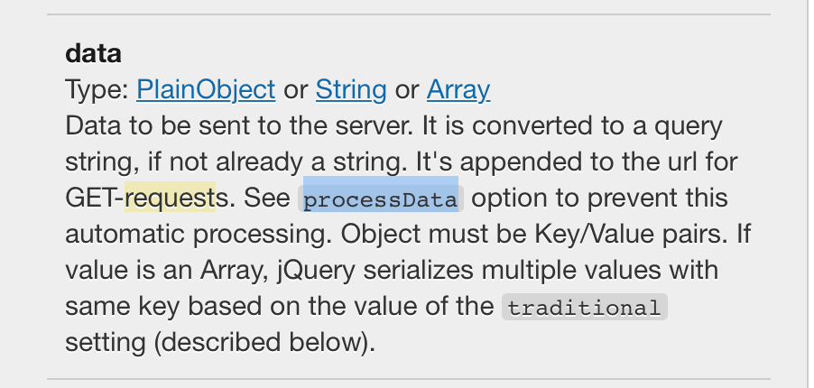

**$.ajax**
==========

**
**

data 在请求数据的 query 里面



**$.map **<http://api.jquery.com/map/>
======================================

Pass each element in the current matched set through a function, producing a new jQuery object containing the return values.**
**

**
**

js或jquery如何获取父级、子级、兄弟元素
-----------------------

**JS**

    var a = document.getElementById("dom");
          del_space(a); //清理空格
          var b = a.childNodes; //获取a的全部子节点；
          var c = a.parentNode; //获取a的父节点；
          var d = a.nextSibling; //获取a的下一个兄弟节点
          var e = a.previousSibling; //获取a的上一个兄弟节点
          var f = a.firstChild; //获取a的第一个子节点
          var g = a.lastChild; //获取a的最后一个子节点

**Jquery **

    jQuery.parent(expr) //找父亲节点，可以传入expr进行过滤，比如$("span").parent()或者$("span").parent(".class")

    jQuery.parents(expr) //类似于jQuery.parents(expr),但是是查找所有祖先元素，不限于父元素

    jQuery.children(expr) //返回所有子节点，这个方法只会返回直接的孩子节点，不会返回所有的子孙节点

    jQuery.contents() //返回下面的所有内容，包括节点和文本。这个方法和children()的区别就在于，包括空白文本，也会被作为一个jQuery对象返回，children()则只会返回节点

    jQuery.prev() //返回上一个兄弟节点，不是所有的兄弟节点

    jQuery.prevAll() //返回所有之前的兄弟节点

    jQuery.next() //返回下一个兄弟节点，不是所有的兄弟节点

    jQuery.nextAll() //返回所有之后的兄弟节点

    jQuery.siblings() //返回兄弟姐妹节点，不分前后

    jQuery.find(expr)  //跟jQuery.filter(expr)完全不一样。jQuery.filter()是从初始的jQuery对象集合中筛选出一部分，而jQuery.find()的返回结果，不会有初始集合中的内容，比如$("p"),find("span"),是从p元素开始找,等同于$("p span").

.toggleClass [http://127.0.0.1:49745/Dash/oxsnzlzq/api.jquery.com/toggleClass/index.hctml](http://127.0.0.1:49745/Dash/oxsnzlzq/api.jquery.com/toggleClass/index.html)
======================================================================================================================================================================

```js


$( "#foo" ).toggleClass( className, addOrRemove );


// 上面的语句 等于下面的操作

if ( addOrRemove ) {
  $( "#foo" ).addClass( className );
} else {
  $( "#foo" ).removeClass( className );
}


$( "div.foo" ).toggleClass(function() {
  if ( $( this ).parent().is( ".bar" ) ) {
    return "happy";
  } else {
    return "sad";
  }
});
```


.data() 获取 data-\* 属性值
----------------------

```js
//HTML代码
<div id="myDiv" data-appid="123" data-myname="lsxj" data-app-id="456" data-my-name="secondname"></div>

//获取属性
var appid = $("#myDiv").data("appid"); //123
var app-id = $("#myDiv").data("app-id"); //456

//属性赋值
$("#myDiv").data("appid","666");

//最终HTML代码
<div id="myDiv" data-appid="123" data-myname="lsxj" data-app-id="456" data-my-name="secondname"></div>


```

.prop()
-------

获取匹配集合中元素的Property的值

```js
.prop( propertyName ) 
.prop( propertyName, value ) 
.prop( map ) 
.prop( propertyName, function(index, oldPropertyValue) )

```

什么时候使用attr()，什么时候使用prop()？

根据官方的建议：具有 true 和 false 两个属性的属性，如 checked, selected 或者 disabled 使用prop()，

```
1.添加属性名称该属性就会生效应该使用prop();

2.是有true,false两个属性使用prop();

3.其他则使用attr();
```

