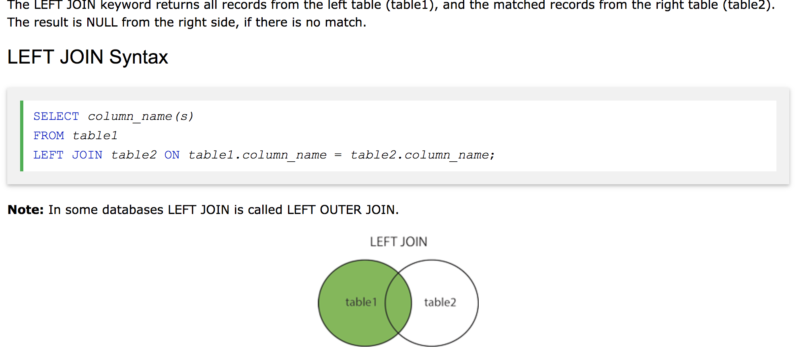
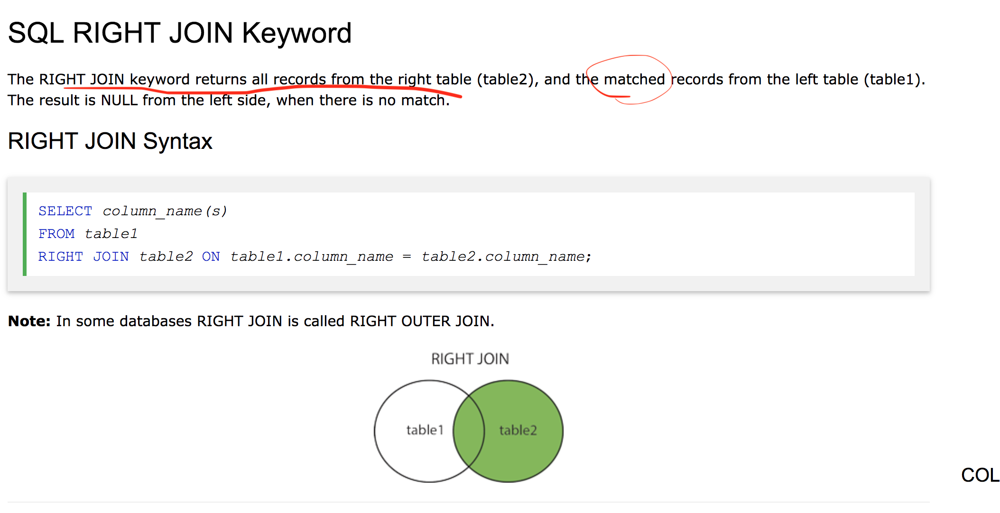
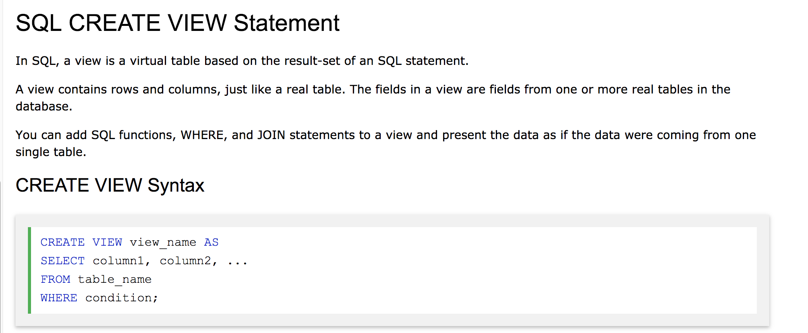

SQL RIGHT JOIN & LEFT JOIN
--------------------------



Left join [https://www.w3schools.com/sql/sql\_join\_left.asp](https://www.w3schools.com/sql/sql_join_left.asp)



SQL CREATE VIEW
---------------

### concept

 

Inner Join && 多个表 关联查询 
-----------------------

```sql
-- https://www.jb51.net/article/51638.htm

CREATE VIEW view_name AS 
SELECT t1.xxx, t2.xxx, t3.xxx 
FROM 
(table1 t1 INNER JOIN table2 t2 ON t1.fid = t2.fid) 
INNER JOIN 
table3 t3 ON t1.mid = t3.mid; 
```


```sql
-- https://www.cnblogs.com/chenpi/p/5133648.html

CREATE ALGORITHM = UNDEFINED 
DEFINER = `root`@`localhost` 
SQL SECURITY DEFINER 
VIEW `view_user_course` AS (
    SELECT
        `uc`.`id` AS `id`,
        `u`.`name` AS `username`,
        `c`.`name` AS `coursename`
    FROM
        (
            (
                `user` `u`
                LEFT JOIN `user_course` `uc` ON ((`u`.`id` = `uc`.`userid`))
            )
            LEFT JOIN `course` `c` ON ((`uc`.`courseid` = `c`.`id`))
        )
);


```

```sql
--一对多个表， 使用 view 视图关联
create view ic_v_product as
  select
    `a`.`id`               AS `product_id`,
    `a`.`origin_id`        AS `origin_id`,
    `b`.`name`             AS `origin_name`,
    `a`.`product_brand_id` AS `brand_id`,
    `c`.`cn_name`          AS `cn_name`,
    `c`.`en_name`          AS `en_name`
  from ((`freshin_dev`.`ic_product` `a`
    join `freshin_dev`.`ic_product_origin` `b` on ((`a`.`origin_id` = `b`.`id`))) join
    `freshin_dev`.`ic_product_brand` `c` on ((`a`.`product_brand_id` = `c`.`id`)));


```


